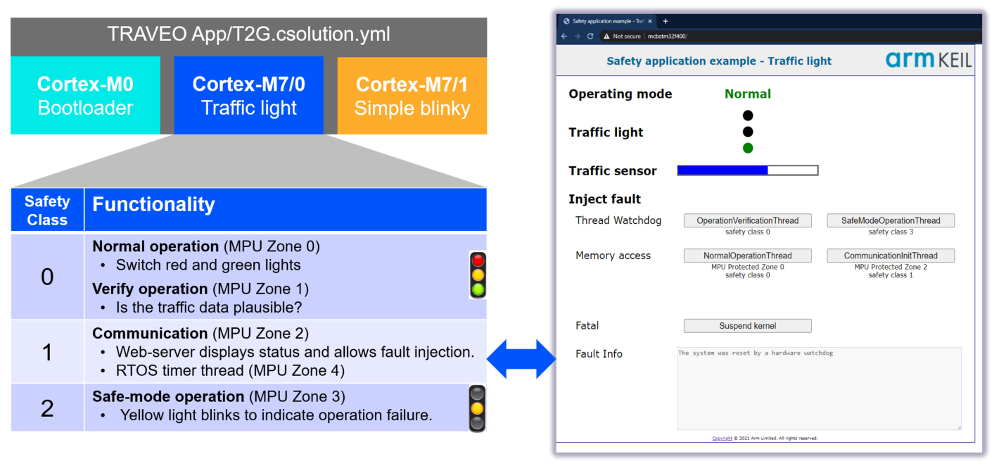
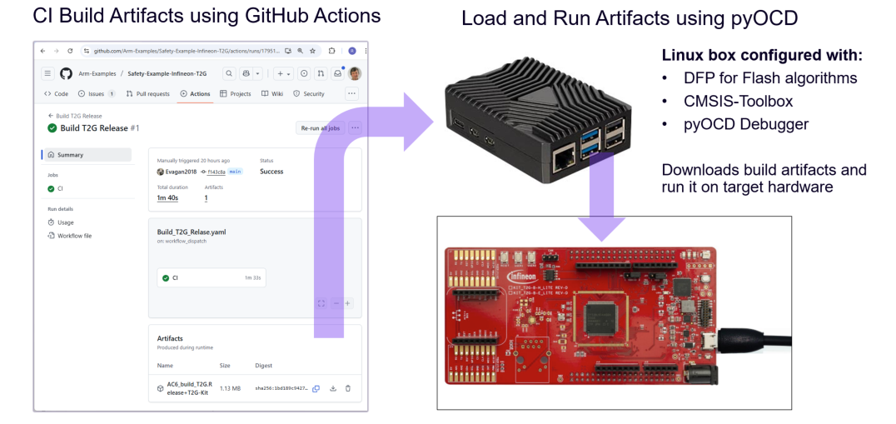

# Safety Example for Infineon TRAVEO T2G Series

This repository contains examples for [Keil Studio](https://www.keil.arm.com/) that run on the [Infineon Kit T2G-B-H_Lite](https://www.keil.arm.com/packs/kit_t2g-b-h_lite_bsp-infineon).

## Quick Start

1. Install [Keil Studio for VS Code](https://marketplace.visualstudio.com/items?itemName=Arm.keil-studio-pack) from the VS Code marketplace.
2. Clone this Git repository into a VS Code workspace.
3. Open the [CMSIS View](https://mdk-packs.github.io/vscode-cmsis-solution-docs/userinterface.html#2-main-area-of-the-cmsis-view) in VS Code and use the ... menu to choose an example via *Select Active Solution from workspace*.
4. The related tools and software packs are downloaded and installed. Review progress with *View - Output - CMSIS Solution*.
5. In the CMSIS view, use the [Action buttons](https://github.com/ARM-software/vscode-cmsis-csolution?tab=readme-ov-file#action-buttons) to build, load and debug the example on the hardware.

## Examples

The examples can be explored using the [Keil MDK Community edition](https://www.keil.arm.com/keil-mdk/#mdk-v6-editions) that is free-to-use for training and evaluation. For evaluation purposes, the open-source variant of [Keil RTX](https://developer.arm.com/Tools%20and%20Software/Keil%20MDK/RTX5%20RTOS) is used which offers the similar features as the commercial, safety-certified [FuSa RTS](https://developer.arm.com/Tools%20and%20Software/Keil%20MDK/FuSa%20Run-Time%20System). FuSa RTS is part of the [Keil MDK Professional edition](https://www.keil.arm.com/keil-mdk/#mdk-v6-editions).

### App/T2G

This is a practical demonstration of Arm FuSa RTS process isolation, using a simple traffic light controller to showcase safety classes, MPU zones, and fault handling on Cortex-M devices.

The [App/T2G.csolution.yml](./App/T2G.csolution.yml) safety example uses three processor cores and contains:

- [App/CM0p_Boot/Boot.cproject.yml](./App/CM0p_Boot/Boot.cproject.yml) implements a simple setup for the various processors and runs on the Cortex-M0+ processor of the device.
- [App/CM7_0_TrafficLight/TrafficLight.cproject.yml](./App/CM7_0_TrafficLight/TrafficLight.cproject.yml) implements the safety-critical application part using functional safety features of Keil RTX (runs on the Cortex-M7 processor #0).
- [App/CM7_1_Blinky/Blinky.cproject.yml](./App/CM7_1_Blinky/Blinky.cproject.yml) blinks an LED and could be replaced with any non-safety application part (runs on the Cortex-M7 processor #1).

The safety-critical application part [CM7_0_TrafficLight](./App/CM7_0_TrafficLight/TrafficLight.cproject.yml) uses [safety classes](https://arm-software.github.io/CMSIS_6/main/RTOS2/rtos_process_isolation_safety_class.html) to protect safe-mode operation. A web interface allows you to inject faults for testing the system recovery features. This part of the example is based on the application note [KAN336 - TrafficLight: Arm FuSa RTS process isolation example](https://developer.arm.com/documentation/kan336/latest).

This example application uses the [Memory Protection Unit (MPU)](https://arm-software.github.io/CMSIS_6/main/RTOS2/rtos_process_isolation_mpu.html) and the  [Thread Watchdog](https://arm-software.github.io/CMSIS_6/main/RTOS2/rtos_process_isolation_thread_wdt.html) available with FuSa RTS.
It does not use:

- The [Shared Memory Protection Unit (SMPU)](https://community.infineon.com/t5/Blogs/Understanding-Shared-Memory-Protection-Units/ba-p/713327) which restricts the access to memory made by each bus-master in the MCU. 
- The [Peripheral Protection Unit (PPU)](https://community.infineon.com/t5/Blogs/Understanding-Peripheral-Protection-Units/ba-p/822859) which protects peripherals with access permissions.

The usage of SMPU and PPU is explained in the application note from [Infineon AN219843 - Protection Configuration in TRAVEO T2G](https://www.infineon.com/gated/infineon-an219843---protection-configuration-in-traveo-tm-t2g-applicationnotes-en_32a66c38-76fc-478e-ba27-0fccba2b2976).

### Test/DriverValidation

The Infineon DFP/BSP software packs do not contain a [CMSIS-Driver Ethernet](https://arm-software.github.io/CMSIS_6/latest/Driver/group__eth__interface__gr.html) or [board software layers](https://open-cmsis-pack.github.io/cmsis-toolbox/ReferenceApplications/#board-layer). These components are therefore developed separately and provided in this repository.

The [Test/DriverValidation.csolution.yml](./Test/DriverValidation.csolution.yml) validates the CMSIS-Driver Ethernet with the [CMSIS-Driver_Validation](https://github.com/ARM-software/CMSIS-Driver_Validation) pack.

## Git Workflow

This repository contains multiple *csolution projects* and is configured as a single Git workspace for VS Code. It can be therefore effectively used with the [VS Code Git integration](https://code.visualstudio.com/docs/sourcecontrol/overview) via the following files:

- [vcpkg-configuration.json](./vcpkg-configuration.json) is in the workspace root directory and installs the tools for all *csolution projects*.
- [.gitignore](./.gitignore) excludes files that contain user specific setup, for example `.vscode` and `*.cbuild*.yml`.

## Continuous Integration (CI) and Hardware-in-the Loop Test

The underlying build system of [Keil Studio](https://www.keil.arm.com/) uses the [CMSIS-Toolbox](https://open-cmsis-pack.github.io/cmsis-toolbox/) and CMake. [CI](https://en.wikipedia.org/wiki/Continuous_integration) is effectively supported with:

- Tool installation based on a single [`vcpkg-configuration.json`](./vcpkg-configuration.json) file for desktop and CI environments.
- CMSIS solution files (`*.csolution.yml`) that enable seamless builds in CI, for example using GitHub actions.
- [Run and Debug Configuration](https://open-cmsis-pack.github.io/cmsis-toolbox/build-overview/#run-and-debug-configuration) for pyOCD that uses a single configuration file `*.cbuild-run.yml`. [Using self-hosted GitHub runners](./Doc/SelfHosted-Runner.md), projects can be tested with [HIL systems](https://en.wikipedia.org/wiki/Hardware-in-the-loop_simulation).

CI Workflow                              | Description
:----------------------------------------|:----------------------------------------------------------
[Build_T2G_Release.yaml](/.github/workflows/Build_T2G_Release.yaml) | Compile application using a GitHub action and save build output (artifacts).
[Run_T2G_Release.yaml](/.github/workflows/Run_T2G_Release.yaml)     | Download to a Linux box and execute the application on [Infineon Kit T2G-B-H_Lite](https://www.keil.arm.com/packs/kit_t2g-b-h_lite_bsp-infineon).

## Files and Directories

This is a list of the relevant files and directories.

File/Directory                            | Content
:-----------------------------------------|:---------------------------------------------------------
[vcpkg-configuration.json](./vcpkg-configuration.json) | Defines the tools that the [Arm Tools Environment Manager](https://marketplace.visualstudio.com/items?itemName=Arm.environment-manager) installs in VS Code.
[App](./App)                              | [App/T2G](#appt2g) contains the safety example.
[Doc](./Doc)                              | Documentation files.
[Test/DriverValidation](./Test/DriverValidation)  | [Test/DriverValidation](#testcm7_0_dv_eth) contains the validation for the CMSIS-Driver Ethernet.
[.github/workflows](./.github/workflows)  | Contains setup for the CI Build and HiL test workflows.

## Webinar

This example will be explained in the [Keil Studio Webinar #5: Multicore and FuSa Development with TRAVEO™ T2G](https://www.arm.com/resources/webinar/keil-studio-session-5) with live Q&A on Tuesday, September 30, 2025.

## Issues or Questions

Use the [**Issues**](./issues) tab to raise questions or issues.
